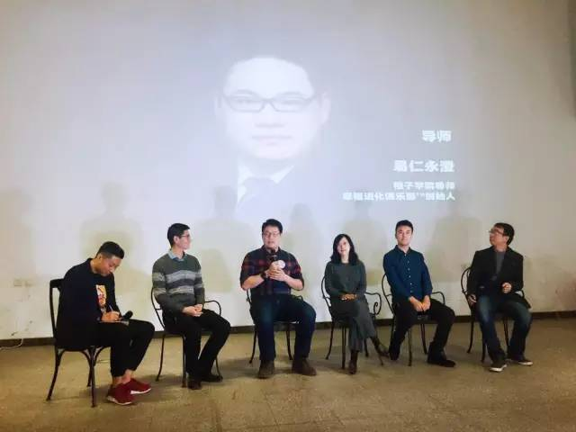
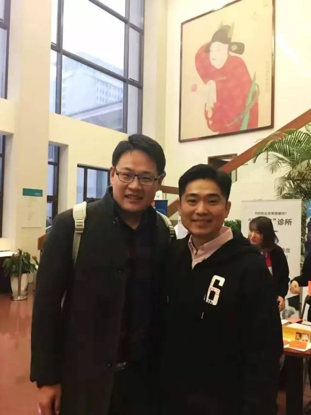

# 橙长节导师分享：2016年最触动我的一条认知

## 文章信息

- 原文地址：http://mp.weixin.qq.com/s?__biz=MzIzOTY0OTA3OA==&mid=2247483722&idx=1&sn=b2a869c9d2e18fedc4c52cddec389a8f
- 分类：札记
- 核心关键词：橙子学院、莫名成功、骄傲、偏见、古典、狭隘

----

2016年12月17日开始，我来到新精英的做自己论坛，昨天一天听到很多老师分享如何做自己，今天轮到我。在2016橙长节上，我作为橙子学院的签约导师，我谈了谈2016年影响自己最大的一个认知——**关于我不听话的故事**。

小强、我、刘佳老师、龙兄、Scalerstalk

都说不听老人言，吃亏在眼前，我就是因为没有听妈妈的话，掉到了今年的坑。而这个老人言，妈妈已经给我说了将近三十年了，那就是**谦虚使人进步、骄傲使人退步**！

说实话，我的耳朵都起茧了~~

你知道么，**有一个很可怕的失败叫做不知道怎么就成功了**！

2013年我在发改委工作的时候，因为在互联网上讲课，当年一个“使用Doit.im实现GTD全流程”的分享，一个人卖10元钱，课程开始前竟然有2317人报名。到年底最后的时候，我竟然收入了17倍的原有年薪。

我从来没有看过那么多钱啊！我整个人都震惊了：原来我是这么的牛逼！我竟然随随便便就可以赚到父母一辈子的收入，我的水平也太高了吧！

这就是我当年的真实想法，其实，我并不知道一点：**所有的失败都可以在自己身上找到问题，但是所有的成功，运气的成分都很重！**但是，当时的我并不知道这一点。

现在回想来看，2013年是在线支付刚刚推出的时候，有巨大的红利，任何一个人敢在网上卖知识，都能卖出那么多钱！那并不是我多厉害，恰好赶上好时候了而已。

你还知道么，**有一种更可怕的失败叫做，不知道如何成功的成功竟然在反复发生**！2014年到15年的上半年，我一直在大额地盈利着，我真的以为那就是我的牛逼了。

我以为日子会一直这么好过下去，可是慢慢地发现了一些奇怪的情况：一些以前从来没有听过名字的小伙伴突然出现在互联网上。这个时候的我，并没有认真观察他们的崛起原因，而是跟自己说：“切，他们玩的那些东西，哥已经在多年前都玩过了，比你们玩得好多了，哥还赚钱了！”然后就心安理得地去获得一劳永逸的安全感去了。

所以，很多新的玩法我都懒得看，明明我可以躺着数钱，为什么非要偏要跪着走路呢？虽然这样的人越来越多，我依然骄傲自大地跟自己说着同样的话。

直到有一天，团队的小妹子跟我说：老板，我们已经很久没有赚钱了；直到有一天，我听说，有人竟然在我团队想要挖墙脚了……

我才知道，肯定是哪里有问题了。

于是，就有了11月份7天只睡25小时的那个记录。很多人问我说：“永澄，你为什么那么拼呢？你不要考虑你自己的身体么？”

其实，你们并不懂的是：我哪里是拼，我是在逃命！因为我的偏见、骄傲自大把自己逼上了绝路，再不抓紧逃命，就死定了！

好在，自助者天助。慢慢地我从危机中摆脱出来了，又慢慢地回到了风口浪尖。现在想想看：**视野狭隘的最大恶果是偏见，而陷入自以为是的境界是因为没有遇到真正的高手**！

古典老师在本届论坛上说：真正的做自己，其实是能够把自己嵌入到更伟大的系统中去的过程。这句话很触动我，**只有持续地接入到更大的系统中去，才会避免偏见和狂妄**！

接下来，我要跟更伟大的人、更好的老师们在一起，让自己获得更大、更持续的成长！

----

留言链接：暂无留言