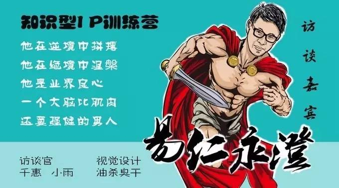
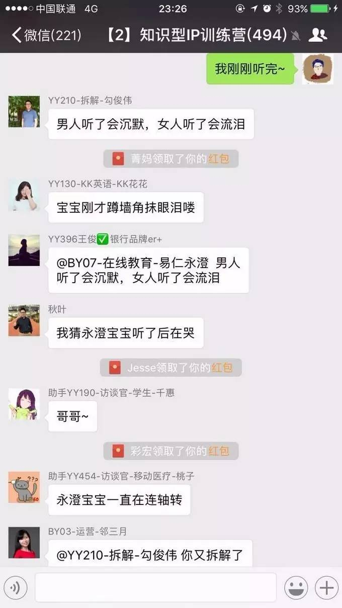
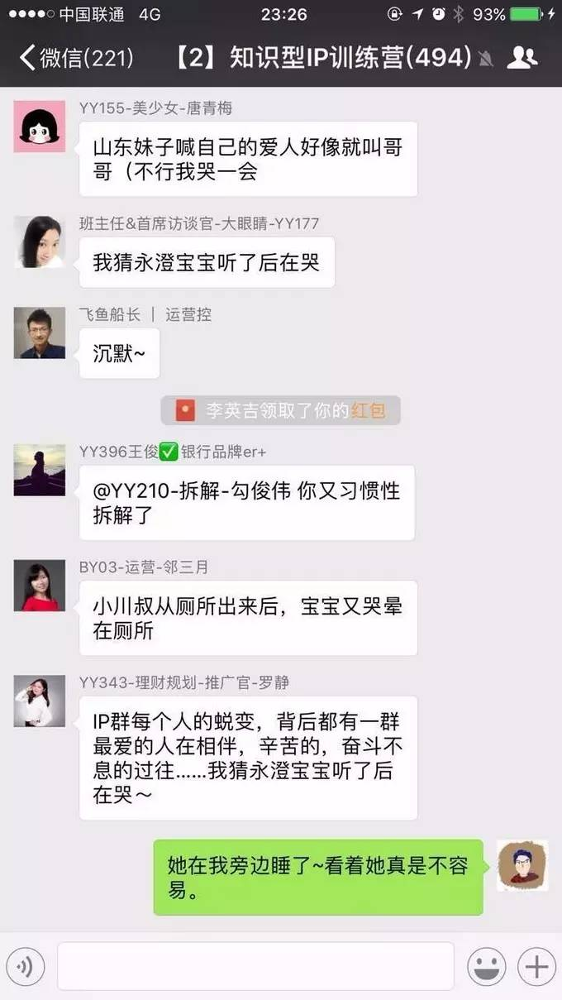
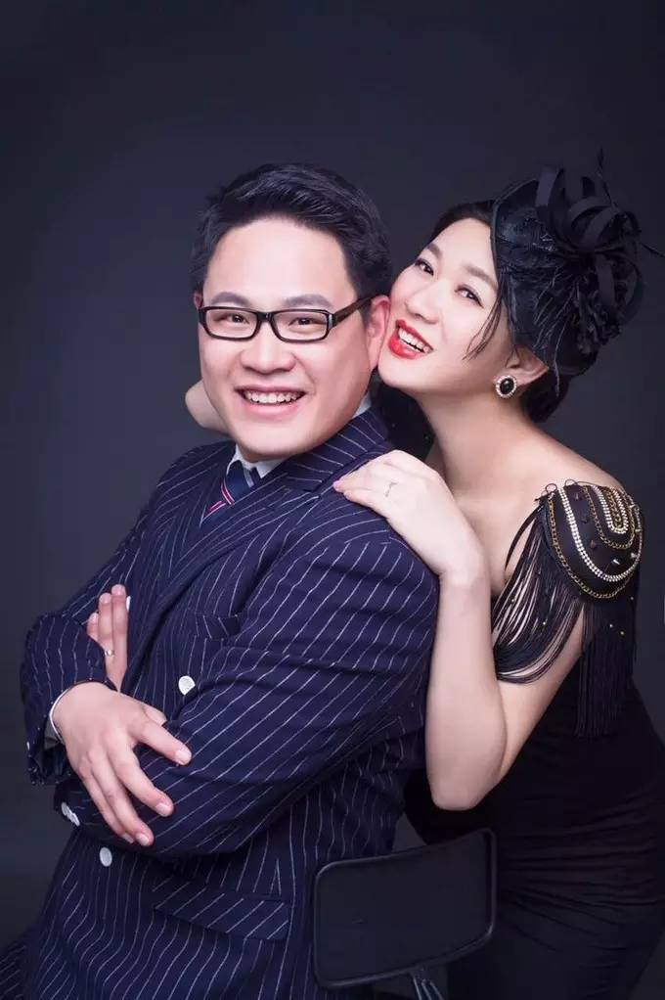

# 是什么可以带来源源不断的勇气？

## 文章信息

- 原文地址：https://mp.weixin.qq.com/s?__biz=MzIzOTY0OTA3OA==&mid=2247483729&idx=1&sn=37f9c6bb224139930f9f681ca9fc1d0a
- 分类：札记
- 核心关键词：IP营、汪隽子、勇气、爱、责任

----

十二月份，我和知识型IP训练营做了一次访谈活动，这是大眼睛老师和她的访谈团队负责的IP营全新项目。大咖访谈是对IP营中的高手和进步比较快的（我符合后者）进行一些有针对性的访问。目前已经完成3期，并且安排了后续的9期~

我的这期叫做《访谈 | 想要实现目标，就找易仁永澄！》（文章尾部阅读原文），通过几组数字来看一下这个访谈的用心程度：

• 5大类19个问题对我全面分析；

• 从采访稿到定稿共改版9次；

• 经过访谈组超过6天的集中讨论；

• 设计稿共画了6张；

• 提前13天完成了神秘惊喜的筹备；

• ……

这一切全靠访谈组的几位老师共同完成的！就看我的一期访谈竟然投入了这么多力量，尤其是**大眼睛姐姐在最后送了一段她写给我的话，并且让汪隽子录制了5分50秒的录音**，直接打中了我！

在这里，感谢大眼睛姐姐及团队的关注和用心！

原本，我只是认为我要配合采访组做一下宣传活动，所以，我只是邀请了公众号分舵和土豪分舵的伙伴来帮忙热闹一下场子。没有想到，大眼睛姐姐告诉我这篇文章最后竟然有汪隽子送给我的密语。

其实，我也是老油条了，毕竟作为传媒院校出身、多年老师、套路心机Boy，我也常搞这个套路啊。但是，大眼睛姐姐的招数 + 汪隽子的那段话还是触动了我，同时也打动了在场很多伙伴。

这一切也激发了我后续的那段群内发言：

听完汪隽子的录音，看着她在我旁边睡了，真的不容易，让我说说我现在的感受吧。

有的时候，我会对自己说，放弃吧，为什么要把自己搞得那么累。我家里什么都不缺，吃爸妈留下来的，估计这一辈子都用不完，为什么还要这么拼？为什么要放弃家里所有的资源，去找一个自己完全没有资源的地方白手起家？

可能，你并不知道我们在结婚的时候发生了什么。原本，我们定了去马尔代夫旅游，但是，因为当时价格要1.8万每个人，并且我的护照也没有办好，最后我们竟然去了河南郑州少林寺，要知道，那是蜜月！

我记着那个日子：2011年10月3日-7日！

从那时起，我觉得我亏欠她一辈子，这个情结一直在我心里，我欠她一个好的蜜月，我要给她我能给的最好的生活！

所以，我希望她买衣服不用跟我说这个便宜，买这个吧；不希望做美容的时候不用说哥哥我不去了，挺贵的；出去玩的时候不用说我们就在周围的城市转转吧！

其实，IP营里的每个人都很努力，我并不特殊。

可是，我最特殊的地方是：**我有巨大的勇气**！我用这个勇气去面对“三线城市、我不是最好的、我没有资源、我懂的太少了”的资源。

**这份勇气，来自于那份爱，这就是我的原动力**！

可是，男女的爱还是太小了，更大的爱、更大的原动力来自这里：来自小怡在一起群搭我的话、猫爷跑着去帮我买药、教主和秋叶大叔毫无保留地告诉我他们懂的一切、慧敏说“放着我来”、小荻跳过来说公主抱、大眼睛姐姐说为了你爱的就对了、小六让我醒过来和赛美姐永远坚定鼓励我的那个眼神，还有我的秘密武器——土豪群！

让我充满力量，是这个环境，是IP里的每个人！未来，我想用我的力量，虽然微薄，但会全力以赴地给我们IP营的其他更多的人，用我的爱给你带来力量，让你有勇气前行！

希望我们能够走得更远！有爱，我们一定会更好！

我是一个幸运的人，我可以在细分领域中拥有影响力、在目标管理中拥有全系列的产品、在变现上拥有基本能力等等现在的一切，主要来自于他们：

• **家庭**：汪隽子和父母大力的支持，他们把家里所有的事情都承担了，让我去做我想做的一切；

• **团队**：有12个伙伴从全国各地来到威海跟我一起打拼创业，为职场青年服务；

• **老师**：我有秋叶、秋水、肖杰等前辈老师，有小桃、慧敏、猫爷和土豪群的同辈老师，他们毫无保留地指导我。

前几天看到一篇文章，说有一样东西比智商和情商更重要，它叫**坚毅**，这是一种推迟满足感的能力、是面对恐惧依然可以带着恐惧淡然前行的能力！它的背后需要一个非常重要的东西：**勇气**！

很多时候，我都很想直接撂挑子不干了，为什么要那么拼？为什么要那么认真地做产品？为什么当自己受挫的时候还要面带微笑？**是谁给我了勇气？**

是谁给我了勇气？我记得我是一个妈妈不按时回来会哭闹的孩子、是一个见到陌生人脸红的内向男孩、是一个不敢去面对公众说话的屌丝、是一个不敢走出去面对他人的自卑创业者……

我知道，如果能够找到源头，那我就可以拥有无限的勇气了，就可以持续突破成为更好的自己了！终于，正是一篇不经意的访谈文章，让我明白了这个道理：

**勇气，来自于爱，她爱我、他们爱我，同时，我也爱着她，爱着他们！**

爱，会带来责任，责任是明确的身份、清晰的标准、果决的行动！想想看，当我要想成为一个好丈夫、团队带头人、成长者，那么标准就会确认，行动也将持续实施；那么，外表看起来，自然是一种有勇气的状态。其实，**源源不断的勇气来自于责任和爱**！

光说不练空把式！这里有个好方法帮助自己找到勇气，你只要问问自己：

**我是谁的谁，这样的我要为他做些什么，我要做成什么样的？**

比如说：我是团队的负责人，这样的我要为他们实现能力的提升、收入的增加，我要做到让他们从最适合自己的部分开始提升能力、让他们每个人都可以承担收费项目、让他们感觉到满意！

想想看，既然自己有这个身份，那路上的阻碍就不算什么了，全力以赴而已！来试试看，留言告诉我你的勇气来源吧，让我也感受到你那一往无前的力量！

----

留言链接：本文暂无留言