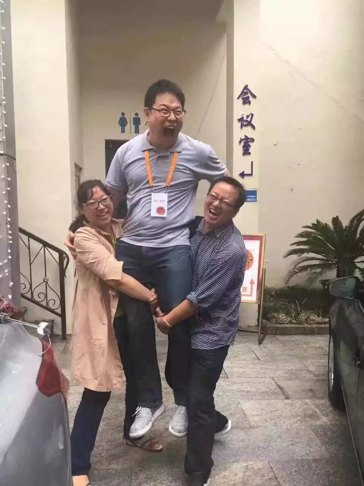
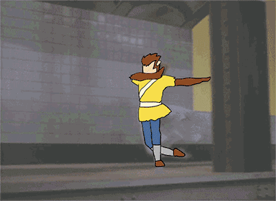
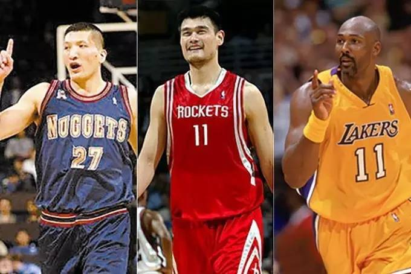

# 喂，我的大腿凭什么给你抱？

## 文章信息

- 原文地址：https://mp.weixin.qq.com/s?__biz=MzIzOTY0OTA3OA==&mid=2247483741&idx=1&sn=7f81b4d8679f37d757d51e9830966018
- 分类：札记
- 核心关键词：插件、挂件、抱大腿、方法、价值、交换

----

今天又遇到了个伙伴跟我联系：

为了事业发展，我把自己打扮得像个公众人物一样，于是，就会遇到很多伙伴在听完课之后，跑来说：**老师，我要抱你的大腿！**每次听到这个的时候，我都会留下同样的一句话：**要落实行动啊**，可是真正落实行动的人不太多。不过，也确实有人落实了，直接把我的腿就抱起来了……

这两位分别是幸福进化俱乐部行动类训练营负责人Digman和我的财务总监太阳姐，按理说应该是我来抱他们的，因为他们已经默默支持我有三年之久了，我觉得特别亏欠他们。

记得11月份我去深圳，在线下分享了个人成长的六大元规范，现场我们拍照的伙伴很多，互相交流微信号的朋友也不少，但是我记住的有以下几个人：

• **谢小强**　他一直在帮我跑前跑后，送我去机场、帮我买了可以无限加面的兰州拉面。

• **郭依依**　她很努力地更新公众号，说是要抱我大腿，但是却经常在帮助我。她帮我指出公众号运营中的问题，并且帮我组织分答和公众号的运营。

• **九黎昊天**　他虽然目前工作受阻，但是却会自己掏钱运营起每年200本书的群，并且搞的生动活泼的。

还记得，他们都在现场跟我说要抱大腿的，可是他们仿佛真的落实了行动。而还有其他的人，我慢慢已经记不住了，因为我的脑子容量实在太小，更有可能的是**我的大腿也太细了吧**！

我知道很多人为什么愿意说**抱大腿**这三个字，毕竟，我自己也经常想要去抱大腿，比如说抱着秋叶大叔的大腿。因为，抱大腿意味着可以有个依靠、意味着未来的发展有了一定的保障。

可是，抱大腿不见得都有依靠和保障，看看篮球运动员们的抱大腿吧：

• **黄金抱大腿**：他叫做巴特尔，特别神奇的是，他去了NBA打篮球，只打了一年，上场没几次，竟然当年拿了总冠军，他成为中国球员进军NBA的所有球员中，唯一一个有NBA戒指的。

• **白银抱大腿**：他叫姚明，他很是努力，一度带动了中国NBA市场的发展，我认识的若干人在今年依然会把火箭队当成自己的主队！姚明回来了，没有带着总冠军戒指，但是带着未来发展的巨大空间而来。

• **青铜抱大腿**：他叫卡尔马龙，这个兄弟是NBA历史上的传奇，他全年基本上不缺赛，并且40岁了，还是大两双的战绩。可是，到职业生涯后期，他频频更换队伍，想要去拿一枚戒指，最终还是无果退役。

无论什么样的抱大腿，那些球员自己本身都非常努力，所以，至少他们还有大腿可抱，可是，很多天天喊着抱大腿的人，你们到底在想什么？**想的是落实行动，还是占点便宜呢**？如果只是占点便宜，那我的大腿为什么要给你抱呢？

只是想占便宜的人，很可能的原因是他并不知道这个世界的底层运转逻辑是什么：**人和人之所以可以产生关系，都是基于交换的，比如说钱、物、情感等，本质上都是价值，如果没有价值，没有人会愿意跟你产生关系的**。所以，他以为自己不付出任何代价，就可以得到自己想要的。

说到代价，我总是会想到有很多伙伴在答疑中向我提问：“老师，你是否可以教我掌握某某某技能呢？”我的内心每次都在想：可以的，当然可以的，你要达到掌握的层次，你要付出什么代价呢？难道你期待通过一次答疑就能掌握么？图样了吧。

同样的，如果想要抱大腿、成为他人腿上的挂件，至少得有两片夹子吧，否则对方的水平越高，腿上的挂件越多，自己可以抢的位置也会越来越小啊。

再从大腿的角度来看，一开始随便挂两个挂件还可以，一块、两块钱的也不嫌弃，等慢慢越来越多的挂件出现的时候，大腿总不能带几十个挂件出门吧？想想在路上看到满腿挂件的人也是搞笑吧！随着挂件越多，大腿就要考虑留下换掉那些便宜的，换一些貂毛挂件、黄金挂件等等，如果自己还是普通挂件，你觉得可以挂得住么？

改变思路吧！如果嘴里喊着抱大腿、成为他人的挂件，远不如换一个思维方式，那就是**成为大腿们的插件**！什么是插件，就是他缺的地方，你可以补上去，你们在一起构成了更加完美的组合，想想一个普通的螺丝钉，怎么都飞不到天上，而一个恰好用在飞机上的螺丝钉，那很容易实现自己的梦想！

成为插件，补全大腿们最缺的东西！你知道大腿们最缺什么么？是时间，他们都已经拿钱买时间啦，看看他们缺的：

• **重复性的工作**，比如说基础运营、新媒体编辑、文章多平台投稿、语音转录、产品传播等，你只要积极主动、认认真真即可，需要的能力很少的：Excel、创客贴、i排版、复制粘贴就够了。

• **略专业的工作**，比如说配图插画、单一媒体运作、课程数据整理统计、书籍框架整理、资料搜集及研发等，那就需要一些专业技能，并且要有责任心，这个基本需要有一年到两年的运营经验。

• **高级管理工作**，比如说承担某个社群的整体运作、某个课程的整体思考、市场活动的整体策划等等，如果能够在这个层面上成为插件，那更是容易异军突起！

因此，**要想成为大腿的插件，并最终上位的关键，其实是技能要充足**！比如说郭依依拥有新媒体运营的能力（她自己就有公众号：善友为依，做得还很认真），有品牌运营能力（她主动为我构建了400多人的分答交流团），而我恰好就缺乏这个部分的运作时间，所以，我们这个组合就很好地搭在一起了！

其实，这个话题来自于小伙伴的年度目标，有一项目标是：抱20个大神的大腿，我想直接说点啥，但是怕他不能接受，所以写了这篇文章。作为一个明年全年的目标，如果一开始不想清楚，那真的很容易掉坑！

要知道，**抱大腿远不如成为插件，成为插件远不如扎实训练自己的技能**！技能，就是那些你可以很快学完、掌握，只要使用就能产生成果的直接能力。比如说：公众号排版怎么缩进、如何使用创客贴作图、写标题的20种方法、知道如何用FAB写一个产品文案、可以用快速建站给自己搞个网站、拥有写策划的12种套路……

想想看，当技能丰富的时候，选择就多了，本来只会唱歌，但是会弹着钢琴唱歌，就会有更多可能性！也就可以自行选择抱大腿、支撑大腿抑或是成为大腿！

抱大腿的正确姿势，就是要成为不可替代的零部件，让大腿真正需要你、喜欢你，用能力去证明！

所以，请更改自己的目标吧，改成学会20个技能，要更靠谱！如果你学了20个全新的技能，就可以来找我，让我们一起玩！

----

留言链接：本文暂无留言