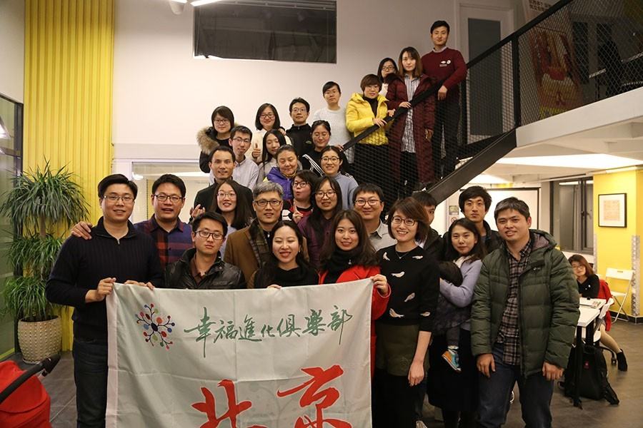
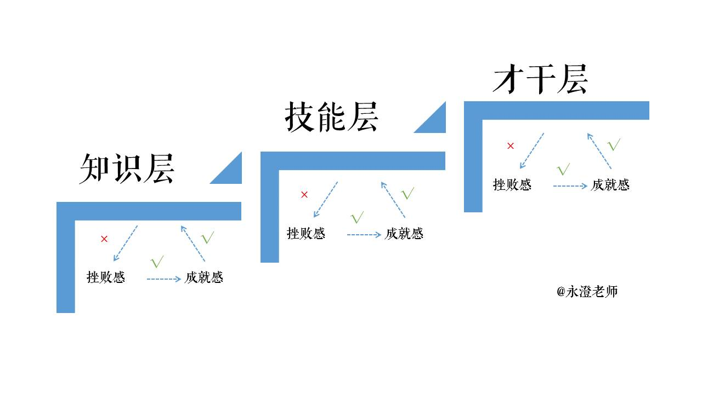

# 三字诀，让普通人也能拥有成就感

## 文章信息

- 原文地址：https://mp.weixin.qq.com/s?__biz=MzIzOTY0OTA3OA==&mid=2247483754&idx=1&sn=c25f6b4ba8dd2dcb906629140625a53c
- 分类：优术
- 核心关键词：北京线下、挫败感、成就感、干丫的

----

来，我们一起来做一个实验，体验一下成就感：

现在拿起你面前的水杯（如果没有的话，你可以假设有一杯水），拿起来放到嘴边，喝上一口里面的白开水，然后把杯子放下。

实验结束了，下面来说说看，你的感受是什么？有没有很强烈的成就感？

（啥，这也有成就感？）
我们不要像皇帝的新衣中那些说假话的人一样，说说看，你有成就感么？我想，基本上你只是会处于蒙圈的状态吧，甚至会纳闷：什么，这也能有成就感么？

的确，在这个实验中，是无法获得成就感的！

上星期天，我在北京幸福进化俱乐部组织的线下活动中，给大家讲解目标分解的五环花工具。因为五环花确实需要一些积累才能很好地使用，所以，到了活动中后期自行训练的时候，有的伙伴就出现了疲惫和挫败的状态、俩俩聊天甚至还有葛优躺出现。

当时，我的**老妈子情结**就上来了！虽然这场活动前我已经有将近30个小时没有休息，虽然我是义务给大家讲解，但是不代表我就可以不负责任！这些慵懒、闲散的状态就仿佛是我的**触发器**，直接激发了我老妈子的状态，于是我讲了一段：**为什么你越失败就更失败的道理**！这里我也简单说说：

首先我先祭出**人类行为本质模型（TMBRT）**，然后用一个例子来说明：如果你拖延一次，最后没有被惩罚，得到一时的满足，那么接下来，你还会拖延下去的，最后得上一个叫做拖延症的东西！

所以，**当某一件事情触发自己并且还可以得到奖励，那么这个触发自己的事情会越来越敏锐，成为自己的开关**。比如说，我每次因为爱之深、责之切而着急地跟学员反复强调，弄得就像老妈子一样，虽然表面上不好看，但是学员们却很领情，于是，慢慢就形成了坏习惯——我一见到对自己不负责任的学员就想说说。

所以，如果遇到挫败就要葛优躺，做事情的标准就会降低，一次两次确实没有太大关系，可是随着标准降低，自己发展的天花板就会降低，于是越挫败就会越失败，越失败就会更失败下去！

你知道多巴胺么？一个可以给人带来兴奋感的东西，我们体内的多巴胺浓度直接决定着我们每个人的状态。

• 罗胖用一小时解读一本书，他会提到很多新奇的东西，我们的多巴胺分泌很旺盛，感觉很好。

• 我们自己看一本书，有的时候要十几个小时，多巴胺分泌一般，浓度较低。

• 要通过读书形成一种思维模式，并应用在工作中，多巴胺的平均浓度就更低了，所以快乐感受就会差很多。

明白为什么有的学习开心、有的学习郁闷的原因了吧？回头看看能力提升，通常来说**能力分为：知识、技能和才干。知识需要学习、技能需要练习、才干需要积累，所以，越靠后多巴胺的平均浓度越低，提升起来越有挫败感**。

但是，越是有挫败感，越要拼上去啊！我们不是要让普通人也有成就感么？不是说要从挫败中解脱出来么？不是有一个神奇的三字诀么？那三个字就是：**干丫的**！

想想看，我们拿起杯子喝水不会有成就感是为什么？因为这件事情本身轻而易举、毫无挑战，没有挑战的事情就没有挫败，没有挑战的事情，完成了也不会有成就感！**只有适当的挑战，带来适当的挫败，才可能产生成就感**！

也就是说：当你感觉某一个东西很难而想要逃避的时候，当你忽然很想把某一件事情做到完美而开始拖延的时候，当你感受到挫败而撂挑子葛优躺的时候，那恰好是成就感产生的前提条件。这时候，更不能有任何放松，否则，就会陷入到越来越差的循环中！

所以，**干丫的**就是这个时候的三字秘诀！问问自己现在在做什么，是否能够一鼓作气、沉浸其中去搞定它？难道真的要被一个问题给干倒么？

在北京线下活动中，我送出了“**干丫的**”三字诀。就这样，很多伙伴都纷纷完成了五环花的训练。我问他们，你们最大的感受是什么，小飘说：“开始确实觉得很难，但是有问题的地方我打问号，做完之后感觉清晰很多，也不会有那种撂挑子的感觉，更重要的是，我觉得自己的力量上来了！”

是的，道理很简单，我再重申一遍：

• 没有挫败感是不可能拥有成就感的。

• 只是一味地挫败下去会让自己更失败。

• 面对挫败感，就是三个字干丫的！

• 努力做到底，挫败感就会变成成就感！

所以，在做任何困难的、以前没有做过，但是又对自己非常有意义的事情，真的不要想得太多，就是一句话：**干丫的，先拼出来再说**！

今天，跟我一起思考年度期待、制定年度目标的伙伴要提交全年目标了，如果这里有一个选择，你会选什么？

<iframe allowfullscreen="" class="vote_iframe js_editor_vote_card" data-display-src="/cgi-bin/readtemplate?t=vote/vote-new_tmpl&amp;__biz=MzIzOTY0OTA3OA==&amp;supervoteid=460218084&amp;token=1079262838&amp;lang=zh_CN" data-display-style="height: 145px;" data-src="/mp/newappmsgvote?action=show&amp;__biz=MzIzOTY0OTA3OA==&amp;supervoteid=460218084#wechat_redirect" data-supervoteid="460218084" frameborder="0" scrolling="no" src="https://mp.weixin.qq.com/mp/newappmsgvote?action=show&amp;__biz=MzIzOTY0OTA3OA==&amp;supervoteid=460218084&amp;uin=MTc4OTM3ODkzOA%3D%3D&amp;key=af89d8d39c7c894fd19dd46d29bb2cb36452568c2a0d94d769bedd4920991f80b487885afdb5bd69e42d019920a276e6e1ff78866262863d9e89ec5bc7e630446f6c157680b2fe67c9f4b961fcc25bb0&amp;pass_ticket=fysuXv%252F0ybIb1MuR3AFkZTaTGUqx2r%252B38L79zFsHjsHPygNrVAMfy9TMsBn0L33D&amp;wxtoken=2106561524&amp;mid=2247483754&amp;idx=1" style="margin: 0px; padding: 0px; max-width: 100%; box-sizing: border-box !important; word-wrap: break-word !important; display: block; width: 604px; height: 246px; border: 0px; background-color: transparent;"></iframe>

同时，问问自己：在未来，无论是学习知识、提升技能还是积累才干，无论是多巴胺分泌的多与少，当面对挫败的时候，自己到底是被恐惧干倒，还是大喊一声干丫的，然后带着满满的能量前行呢？

----

留言链接：本文暂无留言
