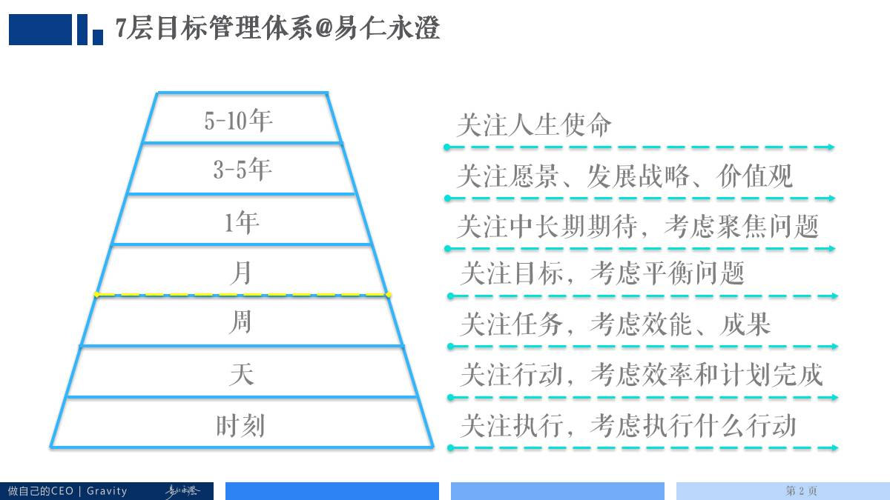
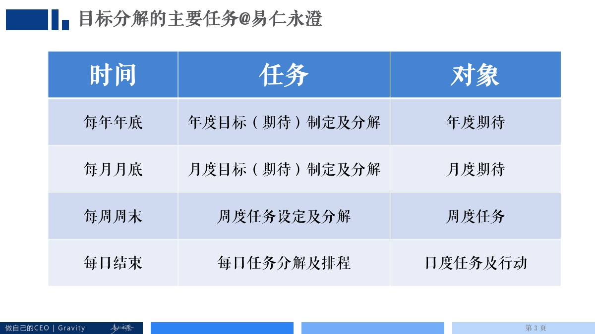

# 如何快速制定年度目标

## 文章信息

- 原文地址：https://mp.weixin.qq.com/s?__biz=MzIzOTY0OTA3OA==&mid=2247483758&idx=1&sn=f84453d0dc6aa60a8613db6edb2f351d
- 分类：优术
- 核心关键词：期待、方法、理论框架、市场分析
路径、发展总结

----

自从十一开始做345烧脑狂欢节，紧接着就赶上了生病休息、CEO第七期开课、我去全国拜神、向组织揩油活动等一系列活动，终于把时间腾出来，写一篇技术文章。本文的核心目的就一个：澄清年目标到底如何制定，澄清方法有两个意义，首先是给向组织揩油活动的学员们一个精准的参考，其次要说明制定年度目标这件事情的纯干货到底是什么，总的来说都是要给大家节省探索的时间。所以，我将从目标制定市场现状、核心概念定义、方法说明、案例指引四个方面来做具体澄清。

## 目标管理市场现状

**（一）市场整体情况**

目标管理市场范围很大，从不同角度来划分可以分为：

- **按照时长**：日、周、月、季度、半年、年、多年

- **按照类型**：计划、回顾

-  **按照环节**：目标制定、分解、达成

- **按照特色**：战略、梦想、目标制定、目标达成

- **按照精准度**：范围目标、精准目标

可对接下游的市场也很多，比如说：时间管理（如何提高在日周层次的时间效能）、知识管理、精力管理、情绪管理、战略管理，如果细分到某一个领域中去的话，例如健身、整理、能力提升、升职加薪……可以说，任何人都是需要目标管理的！所以，总结一句话：**目标管理市场非常大，也很有前途**，这就是为啥我要把我自我管理的标签后置，不说自己是自我管理专家，而是强调我是目标达成专家的原因，也是我把Slogan改成：要想达成目标，就找易仁永澄的原因。

**（二）市场悖论**

按理说，这么大的市场并且用户的需求量很大，应该有很多人在其中竞争才是。但是，通过日常的观察来看，这个市场的从业者很少，只是在年底才会集中出现，主要分布在年度回顾、年度目标制定这两件事情上，其他时候很少有人提到目标管理。这不是明显的悖论么，究竟为什么会出现这种情况呢？

我自己分析来看，核心原因是：**可复制性差**。虽然讲目标管理的人很多（比如咨询师、教练等，都是目标制定和达成的高手），但是，于是客户个体情况差异很大，导致从业者受到制约：

- 自身视野、能力限制，帮助他人指导目标时，难有突破性；

- 自身经验限制，只对自己的行业有经验，其他行业很难跨越；

- 自身时间限制，完成一个案例所需要花费时间巨大，很难批量处理。

所以，因为这些限制，导致很多人可以做好1v1指导，但是却因为可复制性差，无法将市场做大。

**（三）我的期待**

回顾自己九年目标管理的经验，我多期待在过程中能有课程供我学习、有老师能给我指导啊，我就不至于摸索那么久了！推己及人，肯定也有很多人跟当年苦苦试错的我一样，既然有人有需求，我就要去尝试，再难，不代表不能做，再难，也不代表我做不好！

同时，我还有个想法，既然可复制性差、靠一己之力难以做好，那我就把我的思路公开出来，让更多人可以共同传播，这样不就可以避免了上述悖论的问题了么。今天，我就把年目标制定的道理来说说清楚。

## 年度目标的概念定义及澄清
**（一）整体理论框架**

来看一下目标管理体系图：

*上图是我九年目标管理精华的积累。为更容易理解，2016年12月14日，将原来1年关注“中长期目标”调整为“中长期期待”。*

来看看年度高度上，我们在关注什么：**中长期期待、聚焦问题**。这是什么意思呢？我们分别来看看：

- **中长期期待**：所谓中长期，时长范围为1-3年的时间；期待，指的是自己想要的。组合在一起：**中长期期待就是1-3年内自己想要的（人、事、物）**。

- **聚焦问题**：聚焦就是如何将关注点不断地收敛至1-3个，并且，用这1-3个关注的要点，拉动其他各部分同时发展。

所以，总结一下上面的内容，年度高度上，**我们考虑的是如何用1-3个自己想要的人事物，来带动自己全年的全面发展**。比如说：两年后，我希望自己可以考上博士，只要考上了，那我这一年就非常满意了，其他的事情做不做都没有多大所谓了，那么，“两年后考上博士”就是一个很好的期待。在制定年度目标的时候，就可以围绕着这个期待来展开了。

**（二）常见定义澄清**

在年度目标制定这个领域中，有几个概念必须要澄清，要不很有可能导致出现混淆的情况，这几个词分别是：**期待、成果、重点任务、标准**。分别定义如下：

- **期待**：就是自己想要的，我们可以用这样的句式来获得期待：“**我想要XXXXX**”，这里的XXXXX就是期待。比如说：2017年，我想要赚200万，那么，赚200万就是期待。所以，想要确定期待并不复杂，只要说说自己想要什么就好了。

- **成果**：很多人在没有经验支撑的情况下，会将期待说得很虚，比如说：我想要在明年更好地成长，可是，什么叫做更好地成长呢？这是很难定义的。所以，我们通常需要用成果的方式来判定期待是否实现，也就是问问自己：**如果取得了什么成果（认识了什么人、做到了什么事情、得到了什么东西），那就表明自己实现了这个期待呢**？所以，一个具体可以清晰感知的成果，是将期待具体化的最佳方式。

- **重点任务**：要取得成果所需要做的任务列表。比如说：我的期待是2017年开一个全国Up+聚会，那么成果之一就有一次完整的会议，设定的任务可能就是：筛选嘉宾、租用场地、准备物料、活动现场、回顾总结、宣传发布……这里要特别强调一点：**执行任务的目的是为了获得成果，如果没有说清楚成果就开始考虑任务，通常会陷入低效的、忙碌无重点的状态**。

- **标准**：做任何任务都要有标准的，比如说最简单的打水，是装半桶还是全装满、桶外面有没有水渍、每天打几次等等都是标准。标准通常要求可以测量、可以量化，尽可能使客观存在的（不要说打半瓶水，而是说打300毫升，就是客观的，客观指的是：每个人看上去都是一样的）。

很多人就是因为概念太多，导致不愿意继续学习下去，这就是第一次做年度目标的人通常遇到的最大问题。但其实上，仔细看看，拿出自己的例子在纸上划拉划拉，也就清楚了。

**（三）最容易混淆的概念——目标和年目标**

首先提一个问题：**我们规划明年全年，究竟要形成什么成果**？是年度目标、还是年度期待、还是目标分解表？因为这个问题不清楚，很多伙伴可能会陷入到迷茫之中，并出现以下的问题：

- 我的目标不知道怎么描述怎么办？

- 我的期待不知道怎么直接分解怎么办？

- 我的目标有很多个怎么办？

所以，我们必须澄清清楚目标和年目标的关系，才能解决这个问题。

- **目标**：这是一个较大的概念，并且内部分类非常多，不同的目标背后对应的思路和工具都是各不相同的。比如说年度目标、项目目标、任务目标都是不同的，所以，**不能因为有目标两个字，就可以套用某些固定的思路，比如说SMART**。比如，年度目标上就不能谈SMART这件事。

- **年度目标**：指的是某一个个体在下一年度中**想要**发展的大约方向，要实现的成果、达成的状态，前面把“想要”（就是上文提到的期待的概念）两个字标注颜色，通过定义可以看出来，**在个人目标管理中，年度目标可以等同于年度期待，不需要使用SMART工具澄清，只要大约有一个较为明确的方向和范围即可**。

在这里重点申明：**做为一个个人制定的年度目标，就是把下一个年度的期待说清楚并明确实现期待的重要任务即可**。为什么要把年目标制定这件事情的标准定得这么低呢？为什么不把具体的任务列清楚，写明标准（比如说，我想要成为博士，就要读25本书，每本书都做出思维导图、写读书笔记）呢？原因如下：

1. 对于个体而言，下一个年度想要实现的目标（期待），通常都是自己没有做过的，很难一下子就给出具体的方案，更不能给出符合SMART原则的目标了。所以，只需要把大约方向和重点任务说清楚就可以了。

2. 通常制定年度目标的时候都是在年底，时间精力有限，能够把主要发展方向想清楚就好了，**不一定非要在年底的某一天把全年的重点任务层层分解展开**，因为我们可以在每个月底来进行月度目标分解的时候再把任务分解成更小的任务即可。具体看下面的目标分解的主要任务和对象表。

所以，年度目标（年度期待）其实很容易制定的，只要大约想清楚即可，关键在于之后月度、周度、日度的落实。

## 如何快速制定年目标

在正式开始之前，我们一定要对这个标题的概念说清楚，标题中提到的“制定年目标”一词，含义为：

- **澄清自己的年度期待**。明年自己要发展哪些方向（1-3个），在一年里大约要发展成什么样子？

- **澄清年度期待标志**。也就是把成果说清楚，即实现什么就标志着期待达成。有的时候期待比较虚，比如说我要提升沟通能力，那什么才叫提升沟通能力了呢？到年底的时候问问自己取得了什么样的成果，沟通能力才叫提升了呢？所以，这里要尽可能说清楚什么可以标志着期待达成。如果说不清楚，那就判断一下身边谁的样子就是你想成为的样子，你和他之间的差距具体是什么，记着，越具体越好。

- **澄清期待达成路径**。如果要想取得那些成果来实现期待，自己大约要如何走？比如从北京去广州，可以坐飞机、骑自行车、先去天津再坐船过去……都是不同的路径，并且从中找到最高效的那条路径。

- **澄清期待达成的重点任务**。在选中的通往期待的路径上，要做哪些重要的任务，来确保这个期待可以达成呢？比如说我要学习个人成长方法，可能的任务有：①先去约见老师，问清楚个人成长方法到底是什么？②再根据自己的状态形成方案；③推进方案，定期反馈并调整；④半年评估；⑤持续推进到年底；⑥年底评估。那上面罗列的任务，基本上可以满足整个路径的设置，做到这个程度基本就可以了。

所以，制定年目标的含义，并不是真正做一个符合SMART原则的目标体系，而是**找到期待、确定成果、明确路径、设定任务**即可接下来我们看一下方法：

**（一）快速方法**

1. 首先，确定自己的年度期待。可以使用话术：

    - 明年我最想认识的人、做成的事、得到的物是什么？不要超过三条？（解释：这就是年度期待）

    - 如果这三个期待都实现的话，自己的满意度是几分？10分是非常满意。（解释：自己满意才是硬道理，如果满意度在8分以上，这步就通过了）

这个时候，在“年度目标分解表”中写下自己的年度期待即可。

2. 其次，澄清年度期待实现的标志。可以使用话术：

    - 如果我做成什么（人、事、物），就表明我的期待实现了呢？还有么？（解释：请务必具体而明确，越具体越好，想不清楚就打问号，未来找老师帮助自己澄清）

3. 第三，澄清期待达成的路径。可以使用话术：

    - 如果想要这个期待，有什么可以实现的路径呢？还有么？

    - 最高效的那条是什么呢？

4. 第四，列写重点任务。可以使用话术：

    - 为了实现这个期待，大约都要执行哪些任务呢？

最后的模板（你也可以用脑图等其他工具列写）就是：

- 年度期待：XXXXXXXXXXXXX

- 主要成果：XXX、XXXX、XXXX

- 实现路径：XXXXXXXXXXXXXXXXXXX

- 主要任务：1. XXXXXXXX；2. XXXXXXXX； 3. XXXXXXXXX …… n. XXXXXXXXXX

大约核算一下，**只要集中精力，在30-60分钟内，可以逐一列写出所有的年度期待，将其思考清楚，形成明年全年目标（期待）体系**。

**（二）更好一点的方法**

上面的方法虽然快速，但是，可能在后续分解到月度的时候就会有困扰，所以我们可以多投入一个小时左右，来帮助自己做出来更好的年目标（期待）来，只要略微扩充一下话术即可。

1. 澄清自己的年度期待。不变

2.  **【新增】了解这个期待对自己的意义**。可以使用话术为：想要在明年成为期待中的样子，对于我来说为什么那么重要？请列写八条。

3. 澄清年度期待标志。不变

4. 澄清期待达成路径。不变

5. 澄清期待达成的重点任务。不变

6. **【新增】将重点任务按照月度排布，并大约给出标准**。即大约规划一下每一个重点任务要在哪个月、哪几个月完成，大约要做到什么标准。其实，**在目标管理体系中年度的高度上，这就叫做目标分解了**，即：把任务排布到相关月份，并大约说明标准即可。

7. **【新增】澄清任务所需的资源**。由于目前确定的重点任务在第二年才能推进，所以，自己可能会缺少很多资源，那就需要在一开始就把资源的问题考虑清楚。

最后的模板（你也可以用脑图等其他工具列写）就是：

- 年度期待：XXXXXXXXXXXXX

- 目的意义：XXXXX、XXXXX（共八条）

- 主要成果：XXX、XXXX、XXXX

- 实现路径：XXXXXXXXXXXXXXXXXXX

- 主要任务：1. XXXXXXXX；2. XXXXXXXX； 3. XXXXXXXXX …… n. XXXXXXXXXX

- 目标分解：上半年、下半年；一季度、二季度；1月份、2月份、3月份。

我需要资源：XXXXXXXXX……

**（三）一个范例**

这里有个范例，可供参考：

1. 年度期待：个人品牌成功变现

2. 目的意义：我想要把自己的品牌推广开来，成为一业界具有一定名气的理财规划讲师和咨询师，成功把知识变现，帮助对财务有困惑的小伙伴

3. 主要成果：理财规划师资质、3节课、1个公众号有300篇更新、20节分享课、完成100个案例、占据一个平台、20万收益、一个500人的群

4. 实现路径：先考取理财规划师，再研发一个理财课程，同时在随手记、简七理财上进行对接，建立自己的公众号，开设在行账号，等稳定之后大幅度通过在行来打造品牌，过程中参加行业大会并结交行业大牛。

5. 主要任务：

    - 和伙伴共同开发一节理财小白课；

    - 在在行上约见行家，了解本领域脱颖而出的具体方法；

    - 报名准备理财规划师考试；

    - 约见行家，了解如何构建自己的品牌；

    - 开设各种平台的账号并进行装修；

    - 持续接待咨询者，并形成案例发布；

    - 对接理财平台，在平台上形成品牌；

    - 根据情况半年后调整目标。

6. 目标分解：

    - 上半年：考完理财规划师、开发一节课、公众号更新150篇、20个咨询个案、收入5万元

    - 下半年：开发两节课、各个平台分享20此、完成80个案例、和随手记签约、用户群规模500人。

    - 一季度：理财规划师考试通过、开发一节课、约见理财和品牌类行家形成方案、开课、5个咨询。

    - 1月份：报名理财规划师、约见行家形成方案、形成课程并试讲、尝试2个咨询并形成流程。

7. 我需要的资源：

    - 了解有哪些可以发布课程的网站

    - 去找一些可以合作的理财网站和论坛

    - 了解基金资格从业证如何考取

    - 了解理财师如何考取

    - 学会设计课程，选定主题

    - 和同行取经，找到5个同行，请教沟通，请他们给我提意见，拜访他们

    - 课程制作，作出满意的东西来，接受反馈，并调整

    - 学会如何做分享，找到平台

    - 学会链接人脉，资源互换

    - 学习如何建立维护社群

    - 需要请教导师给予我意见（社群，个人品牌，营销等）

    - 需要学习相关书籍（书单另列）

更多的例子请见我们的向组织揩油网站：www.nianmubiao.com。

另外，如果你参加了向组织揩油活动，你的作业提交只需要提交两样：

- 年度目标分解表；

- 一篇帮助自己澄清期待的简书文章（模板在上面）。

其实这并不难，不要再给自己忙碌、完美主义找借口了，只要拿出30分钟，就可以搞定的！加油！

目标管理其实并不容易，很多人都没有做过月度目标的经验，在做年度目标（期待）的时候就更不知道从哪里下手了。新人成长有个很简单的办法，那就是：先抄后超，先把高手提供的方法抄回来，实践、体验并不断改进，最终形成属于自己的更好的方案。年度目标（期待）也是一样，它只是看上去比较难而已，动动手，你也可以轻松搞定！

----

留言链接：本文暂无留言