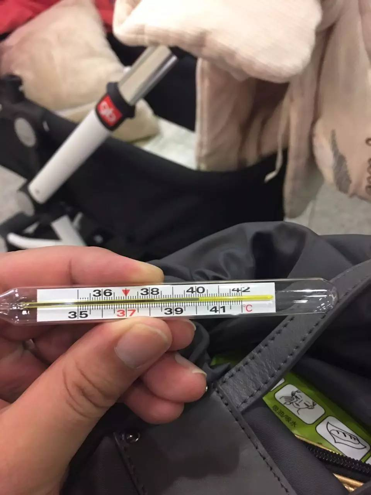
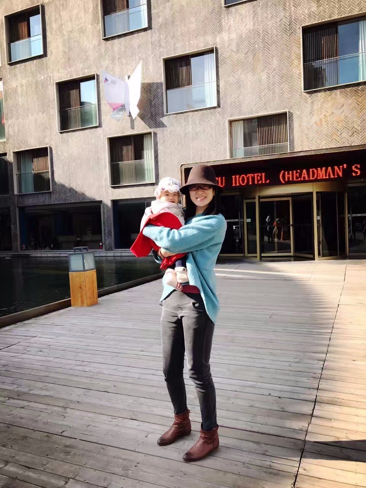

# 创业者你这么忙，怎么过圣诞节？

## 文章信息

- 原文地址：https://mp.weixin.qq.com/s?__biz=MzIzOTY0OTA3OA==&mid=2247483765&idx=1&sn=be03ea761bd399eec150518e55d45913
- 分类：札记
- 核心关键词：RSQC、发展总结、无期待的爱、夫妻关系

----

从上一次生病40.6℃到今天，好像就没有休息过。

- 10月25日开始启动了向组织揩油活动的立项

- 11月2日到8日在全国拜大神，7天只睡25小时

- 之后去了三个城市，完成了三门课程研发

- 进入12月份，每天平均休息5小时

- 还要去各地的年会、活动刷脸

想想没办法，**任何一个事情的推进都有四个要素：****范围、进度、质量、成本**，我要求高质量又要保证进度，只能不断投入成本了。小城市，资源少，自己不拼难道等着天上掉馅饼么？

进入到12月份也真是怪了，前两周的周日都要上课，第三个周又被邀请去新精英橙子学院当导师、嘉宾，这个周终于等到周日了，竟然等来了个圣诞节，心想能休息了吧，可是又被安排了个新任务：去拍定妆照，摄影师只在这一天有空。

说实话啊，看看我家里的两个妹子，真是有点舍不得。汪隽子一直需要来理顺一下禅绕画的下一步发展方向，我都没有时间坐下来好好聊聊（多亏Leanin的Connie大开脑洞，给了很多思路），而小妹子Doubling，我每天抱她的时间加一起都没有30分钟。

创业者和丈夫、爸爸是很容易平衡的，但是一个好的创业者和好丈夫、好爸爸之间，再想平衡，就没有那么容易了。

除了舍不得，更多的是亏欠。不仅仅没有陪伴，更多的是让她去付出、去承担家里的事情。早晨起来给孩子做好吃的，然后喊我起床；孩子睡了她就去把衣服洗了，还给正在上课的我倒一杯水；中午我休息一会，她还要把碗筷刷干净然后赶紧赶去单位……

上一生要做多少善事，才有拥有今天的福分呢！

虽然不见得你也是创业者，但是你总会成为中流砥柱吧？虽然不见得你也像我一样贪婪（想要成为好创业者、好团队领袖、好丈夫、好爸爸……），但是你总会遇到无法平衡的问题吧？怎么办？

今年的年度目标制定课程里，我统计了198份学员的作业，其中有17.4%的伙伴设定了类似这样的目标：**要拥有更加和谐的家庭、陪伴家人旅游XXX次、开家庭会议XXX次，给XXX打电话多少次……**我看到这些目标的时候会特别感动，仿佛就看到了自己的过去，也曾经设置了这样的目标。

只是，今天的我回头看的时候，隐约中发现我们家庭和谐的一个秘诀：**无期待的爱**，当我和汪隽子秉持着这样的要点对待彼此，我们发现家庭就会变得更和谐。我们也不会再设置类似于出国旅游多少次、家庭会议多少次等等的指标，只要把无期待的爱做到就可以了。

啥叫无期待的爱？这里有两个关键名词：无期待、爱，分别解释一下：

- **爱**。爱就是我愿意陪伴你走这条心智成长之路。

- **无期待**。无期待就是当我付出的一切，就是为了你好，并不期待回报。

所以结合在一起，**无期待的爱就是我愿意陪伴你走这条心智成长之路，同时，我并不期待你的任何回报**。

**有一些夫妻在一起，其实是不爱的**。A并不愿意陪伴B走心智成长之路，所以，有的A就在外面突飞猛进把B扔下，有的A也不知道如何跟B交流，有的A发现跟B解释半天都无法解释清楚干脆放弃……这不是陪伴，而是发现这是利益最大化的一种方式，那就凑合着过吧。

我做个人成长这么多年，深深知道一件事：**心智成长太慢太慢了！**所以，我们的口号才是：**慢慢来，持续做**，因为这件事情真的快不了。而陪伴一个很慢的事情，还要等着它能够长大，除了真正的爱，没有其他的力量可以让陪伴能够支撑下来。有的时候陪伴真的很辛苦：看看汪隽子每天要等我到将近1点才睡觉，就知道了。

**有些夫妻在一起，其实是有各种期待的**。A对B好，有的时候是期待B说：你真好，真懂得关心人；有的时候是想让其他人表扬自己；有的时候想要满足内心的安全感而用爱的名义去控制对方；有的时候还把自己觉得好的强加给对方……

想想看有期待的爱：虽然自己抱着满满的爱，但是如果对方没有满足自己的期待，比如说自己期待对方说：“谢谢你”，可是对方说：“嗯，还不错”，这个时候就会因为当没有满足自己最初的期待而产生情绪。无欲则刚，无期待的爱就不会出现这样的问题，由于并不抱着期待，就不会在意对方究竟做出了什么反馈，因为那都和我无关了。

我和汪隽子都是秉持着这样的原则：**无期待的爱**。

所以，她知道我很想抽出时间考虑家庭，她知道要为孩子洗衣服、把家收拾干净、为我倒来一杯水，她知道在我很拼的时候不打扰我……她愿意陪伴着我，不管多晚，我不睡她就不睡，她没有跟我提出任何的要求。

可是，我也是有着同样信条的人，我也要为她着想，我知道她也有自己的梦想和期盼，我要兑现在婚礼上说的“我会尽我所能去支持你做你想做的一切事情”，我也想让她轻轻松松、画着自己的笔尖瑜伽、做着自己的事业，我想让她也可以在圣诞节的时候去感受幸福！

所以，**家庭生活的年度目标到底怎么定，我觉得不如刻意训练这个信条：无期待的爱**。诶，请原谅我，我的主业是目标管理，是帮助他人实现目标，所以正抒情呢就又谈到工作了……

回到主题，创业者的我这么忙，怎么过圣诞呢？

答案很简单：**什么都不干了，带着两个妹子玩去**！

希望看文字的你

**圣诞节快乐！**

----

留言链接：本文暂无留言