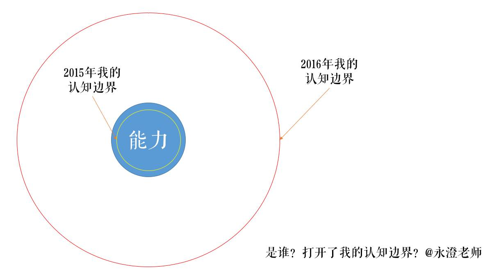
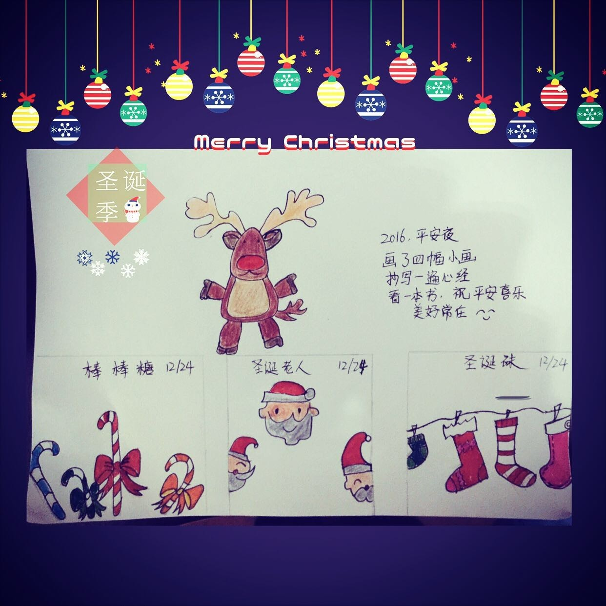

# 估计，你的年度目标里不会想起这件事

## 文章信息

- 原文地址：https://mp.weixin.qq.com/s?__biz=MzIzOTY0OTA3OA==&mid=2247483770&idx=1&sn=8445027bcd0922b908ebde5a37d25b34
- 分类：优术
- 核心关键词：人脉管理、人事网书、5人法、个体崛起

----

在我的年回顾课程里，有个问题我给隐藏在角落里，并没有特别提示，因为我觉得我苦口婆心说了也不见得大家能理解，而这个问题其实是发展的重中之重，就是：“**在过去的一年里，谁影响了你的发展？**”

很少有人问这个问题吧？我说一个朋友的故事。

这位朋友是我在大学当老师的舍友，我们一直关系很好，那时的我们经常一起打球、炒股、讨论人生。他很折腾，原本一个搞艺术的哥们，在学校教数字媒体艺术专业，后来因为各种原因竟然去做了保安公司的经理，然后又回到自己家乡卖游艇，之后搞中小学生辅导班，现在做1-3岁孩子大脑开发教育。

他前几天给我打电话，说了自己的困扰：很想努力把事业做好，但是经常会晚上玩游戏不睡觉、上午睡到11点，明明自己有团队要养、有事业要创，但是就是没有能量、就是拖到不得了。他问我到底要怎么解决这个问题？

我没有回答，而是继续提问：“**在这一年里面，你和谁在一起？**”他一下子停住了，在我反复追问下，他说了几个答案：爱人、家人、孩子（自己的客户），然后再也没有其他的了。我想，没有能量的原因很明显了。

很多人认为自己掌握着人生，所有的成就都是自己通过努力换来的。这句看上去鸡血十足的话，也就能用来打鸡血了，如果轻易相信或者认同，那就很容易掉入自牛逼主义的大坑。

想想看，我和你每天努力工作8小时，下班还会全力以赴学习4小时，只不过有一点不同的是：**我比身边所有人都好，你比身边所有人都差，请问，我们两个谁的发展速度快**？

要认真思考这个问题！

看看我的2015年-2016年，基本上就恰好是这样的**状态**：2015年的时候，觉得我比团队的伙伴视野宽、能力强；2016年4月份之后，发现自己比网上那些突飞猛进的老师差太远。**结果**呢，前一段我基本上处于发展的停滞期，后一段，我虽然总是处于焦虑状态，但是却拥有了长足的发展和进步。

其实，我的努力程度都是一样的，差别就是我关注的圈子换了，他们变成了：王明夫先生、秋叶大叔、秋水老师、古少侠、阳志平老师、战隼老师、忠秋老师、赛美老师、剽悍一只猫、彭小六、慧敏……忽然之间就发现自己的差距。

回头来看，2015年我的能力超出认知边界，2016年恰好反过来，能力远远跟不上认知。当我发现这一点，我就开始焦虑，我要抓紧提升能力，来塞满认知和能力之间的空间！所以，接下来就是持续的成长。

回头，看看开篇的那个问题：**过去的一年，谁影响了你的发展**？影响，有好有坏，好的影响促进自己发展、坏的影响拉住了自己不让自己提升。

很多人并不知道**一个人之所以可以快速发展**的关键：**有一种力量扩张了自己的认知，增加了认知和能力的间距， 我们会充满能量去提升能力，之后成长就会飞速起来**。

还有一个更深刻的猫腻儿：什么力量会改变认知呢？我曾经在《三个套路把你的期待全部变成现实》（*见文末阅读原文链接*）一文中提出：**读万卷书、行万里路、高手指路、自己百度**！这四个方法都可以扩大自己的认知边界。最高效的方法是：找高手指路！

问问自己，在2016年全年的发展中自己是否有被高手指点过？如果你发现2016年自己的成长飞速，这个答案是肯定的，你必然可以找到那个高手！

想象一下，自己有一个花园，并没有太多打理，花园里面就长出了一朵非常漂亮的花。如果我们可以有意识地找出开花的原因，我们的花园一定会越来越好看了！

所以，问问自己，**哪五个人为自己拉开了认知边界**？请你拿出纸和笔，把上面问题的答案写下来。如果你完成了，再往下继续。

2016年已经过去了，我们该看到未来了。我最近看了将近200个学员589个全年目标，竟然没有一个人的目标中考虑到了这个问题：**在2017年，我和谁在一起**？

这个问题很重要的，如果你都不思考，你不怕你的花园中长满杂草么？

我来给你一个很简单的方法，我在培训中经常用到的一个小互动游戏：

1. 请书写近3个月中占据你时间最多的那个人的名字，共写下5个。

2. 分别把这5个人的综合实力和自己水平进行对比。

3. 如果你比5个人水平都高，那必须要考虑更换圈子、朋友了，一直更换到其中3个人的水平都要远高于自己，剩下的2个要和自己的水平相仿。

4. 接下来，你就等着飞奔成长吧！

这是个个体崛起的时代，很多人都在纷纷放出信号，比如说古少侠的《超级个体》更新。所以，2017年你的年度目标里面一定要考虑有这样的人，可以帮你指路，这样的人要：**有自己的专业感、自己在崛起方面有实践和成就、拥有很强的能量、愿意和你分享交流等，找到他们紧紧抱住，不要放手**！

请抓紧思考这个问题，如果你愿意的话，请在后台给我留言，**他们都是谁，为什么希望是他们呢？**如果你的圈子里面希望有我的话，我会努力满足你成长的期待的！因为，曾经被帮助的我，也很希望能够带动更多人在新的一年变得更好。

#### **附**

昨日的后台互动中，青玉轻语伙伴成为12月25日的最佳互动者，你可以拿着这个截图向我提出任何一个问题，我会彻底为您解决。谢谢你看了汪隽子的推送，谢谢你的画。

----

留言链接：本文暂无留言